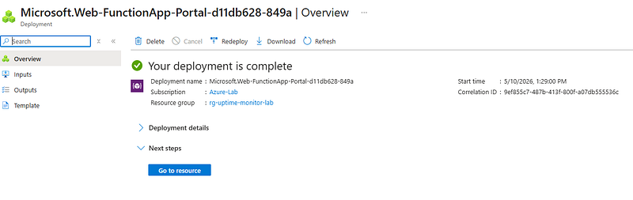
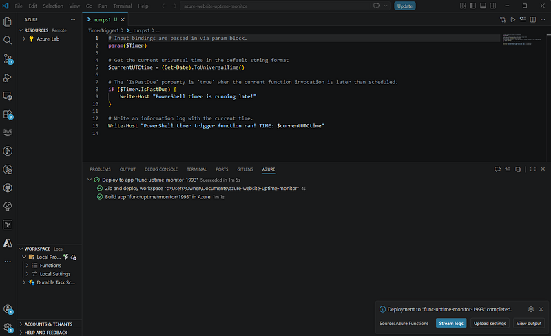
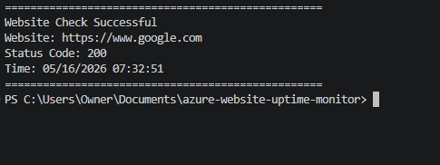
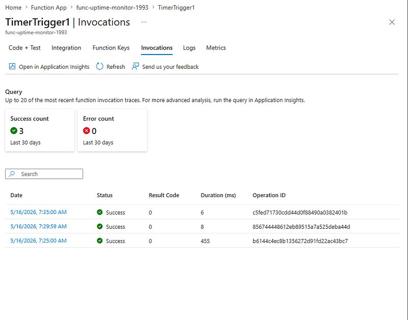

# Azure Serverless Uptime Monitor

## Overview

This project is a cloud-native serverless uptime monitoring solution built using Microsoft Azure Functions and PowerShell.

The solution automatically performs scheduled website health checks using Azure Timer Triggers and logs operational monitoring output through a lightweight serverless architecture.

The project was designed to provide hands-on experience with:

- Azure Functions
- PowerShell automation
- Serverless cloud architecture
- Timer Trigger scheduling
- Local-to-cloud deployment workflows
- Operational monitoring
- Azure observability concepts
- GitHub version control workflows

---

# Full Project Walkthrough

Read the complete Medium article documenting the full deployment, architecture decisions, troubleshooting process, and Azure implementation workflow:

[Medium Article Walkthrough](https://medium.com/@rolandarchie93/building-a-serverless-website-uptime-monitoring-solution-in-microsoft-azure-using-powershell-and-861a128250b0?postPublishedType=repub)


# Architecture Overview

## Core Azure Services

- Azure Resource Group
- Azure Storage Account
- Azure Function App
- Azure Functions Flex Consumption Plan
- Azure Monitor
- Application Insights

---

# Technologies Used

| Technology | Purpose |
|---|---|
| Azure Functions | Serverless execution environment |
| PowerShell 7.4 | Automation and monitoring logic |
| Azure Timer Trigger | Scheduled execution |
| Visual Studio Code | Local development and deployment |
| Azure Storage Account | Azure Functions backend storage |
| Git & GitHub | Version control and repository management |

---

# Features

- Automated website uptime monitoring
- Serverless PowerShell execution
- HTTP response validation
- Timer Trigger scheduling
- Structured operational logging
- Local function testing
- Cloud-hosted recurring execution
- Azure deployment through VS Code

---

# Monitoring Workflow

The Azure Function executes automatically every five minutes using a CRON-based Timer Trigger.

## Monitoring Logic

```powershell
Invoke-WebRequest -Uri $website -UseBasicParsing -TimeoutSec 10
```

The workflow:
1. Sends an HTTP request to the target website
2. Validates website availability
3. Captures HTTP response status codes
4. Logs monitoring output
5. Handles failures using PowerShell error handling

---

# Local Testing

The monitoring workflow was validated locally using Azure Functions runtime tools inside Visual Studio Code.

Example output:

```powershell
Website Check Successful
Website: https://www.google.com
Status Code: 200
```

---

# Azure Deployment

The Azure Function was deployed directly from Visual Studio Code into Azure using the Azure Functions extension.

Deployment workflow included:

- ZIP deployment packaging
- Azure runtime synchronization
- Serverless Function App build process
- Automated deployment validation

---

# Operational Validation

After deployment, recurring executions were verified through the Azure Functions invocation monitoring interface.

Validation confirmed:

- Successful Timer Trigger execution
- Recurring scheduled executions
- Successful PowerShell runtime processing
- Zero runtime errors during testing

---

# Future Enhancements (Part 2)

Planned security and governance upgrades include:

- Managed Identity integration
- Azure RBAC hardening
- Log Analytics integration
- Azure Policy governance enforcement
- Azure Key Vault integration
- Microsoft Teams/email alerting
- Multi-site monitoring support

---

# Author

Roland Archie

Cloud | IAM | Azure Security | PowerShell Automation

GitHub:
https://github.com/rolandarchie93

# Screenshots

## Azure Function App



---

## Successful Deployment



---

## Local Monitoring Validation



---

## Azure Invocation Monitoring

